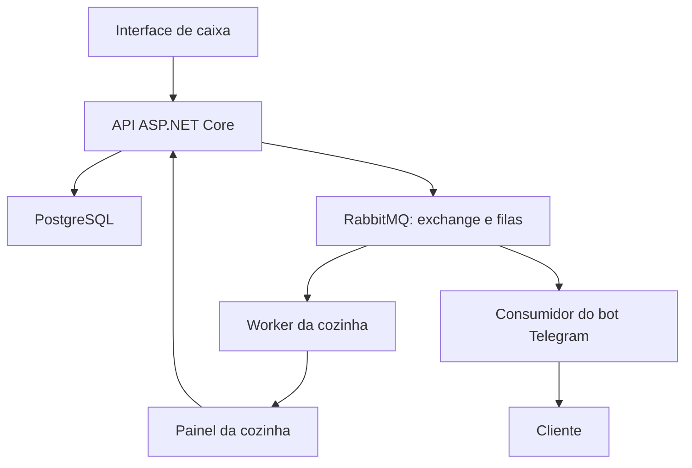

# Kitchen Flow

Sistema para integrar atendimento, cozinha e comunicação com o cliente em restaurantes, com uma arquitetura orientada a eventos usando C#, ASP.NET Core e RabbitMQ.

O Kitchen Flow conecta o pedido recebido no balcão ou por telefone ao trabalho da cozinha e às notificações do cliente. O atendente registra ou altera um pedido no caixa; a cozinha acompanha essas mudanças no seu painel e atualiza o andamento do preparo; o cliente recebe confirmações e atualizações pelo bot do Telegram.

> **Em desenvolvimento:** o cadastro de pedidos pela interface de caixa, a persistência no PostgreSQL e a publicação de `OrderCreated` no RabbitMQ já estão implementados. O painel da cozinha, os consumidores de eventos e o bot do Telegram fazem parte da arquitetura planejada.

## Da entrada do pedido à entrega

1. **Registro no caixa:** o atendente recebe o pedido presencialmente ou por telefone e informa cliente, contato e itens.
2. **Confirmação ao cliente:** o bot envia o resumo do pedido pelo Telegram para que o cliente confira as informações.
3. **Recebimento na cozinha:** o pedido aparece no painel da cozinha, onde a equipe acompanha os pedidos aguardando e em preparo.
4. **Alterações sincronizadas:** se o cliente solicitar uma mudança ao atendente, a alteração feita no caixa atualiza o painel da cozinha e gera uma nova notificação ao cliente.
5. **Preparo e saída:** a equipe registra que o pedido está pronto e, quando houver despacho para delivery, o cliente recebe o aviso de saída para entrega.
6. **Conclusão ou cancelamento:** o sistema registra o encerramento do pedido e comunica os componentes interessados.

O recebimento de eventos pela cozinha permanece ativo, inclusive quando o limite de pedidos em preparo é atingido. Novos pedidos aguardam uma vaga, enquanto alterações e cancelamentos continuam sendo processados.

## Arquitetura

O sistema reúne uma API, dois front-ends e consumidores de eventos:

| Componente | Responsabilidade |
| --- | --- |
| Interface de caixa | Registrar pedidos do balcão ou telefone, editar informações e acompanhar o atendimento |
| API ASP.NET Core | Validar operações, persistir pedidos e publicar os eventos correspondentes |
| PostgreSQL | Manter os pedidos e seu estado atual |
| RabbitMQ | Distribuir eventos para processamento assíncrono por consumidores independentes |
| Worker da cozinha | Processar novos pedidos, atualizações e cancelamentos para manter o painel sincronizado |
| Painel da cozinha | Exibir os pedidos e permitir que a equipe atualize o andamento da operação |
| Bot do Telegram | Enviar confirmações e notificações sobre alterações, cancelamentos e saída para entrega |



A API confirma a gravação no banco antes de publicar o evento. Os front-ends enviam ações à API por HTTP; a distribuição dos eventos entre os componentes de processamento acontece pelo RabbitMQ. O envio das atualizações do worker ao painel da cozinha será implementado na integração da interface.

Cada consumidor terá sua própria fila para receber os eventos de seu interesse. Assim, o mesmo pedido poderá atualizar a cozinha e gerar uma notificação ao cliente de forma independente.

### Eventos

| Evento | Significado | Situação |
| --- | --- | --- |
| `OrderCreated` | Um pedido foi registrado | Publicação implementada |
| `OrderUpdated` | As informações ou o andamento do pedido foram alterados | Planejado |
| `OrderCanceled` | Um pedido foi cancelado | Planejado |
| `OrderDispatched` | Um pedido saiu para entrega | Planejado |

Pedido pronto, saída para entrega e entrega concluída representam etapas distintas. Os consumidores usarão essas informações para atualizar a operação e enviar a notificação correspondente.

## Tecnologias

- **Back-end:** C# e ASP.NET Core
- **Persistência:** Entity Framework Core e PostgreSQL
- **Mensageria:** RabbitMQ
- **Interfaces web:** HTML, CSS e JavaScript
- **Ambiente local:** Docker Compose
- **Notificações planejadas:** bot do Telegram

## Executar localmente

### Pré-requisitos

- SDK do .NET compatível com `backend/KitchenFlow.csproj`
- Docker com Docker Compose
- Python 3 para servir a interface de caixa

Na raiz do projeto, suba o PostgreSQL e o RabbitMQ:

```bash
docker compose up -d
```

Inicie a API com hot reload:

```bash
dotnet watch --project backend/KitchenFlow.csproj
```

A API fica disponível em `http://localhost:5196`.

Em outro terminal, sirva a interface de caixa:

```bash
python3 -m http.server 5500 --directory interface-caixa
```

Acesse `http://localhost:5500` para registrar um pedido. No fluxo atual, a API salva os dados no PostgreSQL e publica `OrderCreated` no RabbitMQ.

## Migrations

As migrations são aplicadas automaticamente na inicialização da API. Para os comandos manuais, é necessário ter a ferramenta `dotnet-ef` compatível com a versão do Entity Framework Core usada no projeto.

Aplicar migrations:

```bash
dotnet ef database update --project backend/KitchenFlow.csproj
```

Criar uma migration:

```bash
dotnet ef migrations add NomeDaMigration \
  --project backend/KitchenFlow.csproj \
  --output-dir Data/Migrations
```

## Próximas entregas

- [x] Interface de caixa para cadastro de pedidos
- [x] Persistência com Entity Framework Core e PostgreSQL
- [x] Publicação do evento `OrderCreated` no RabbitMQ
- [ ] Exchanges, filas e consumidores para distribuir os eventos
- [ ] Painel da cozinha com atualização dos pedidos
- [ ] Controle de pedidos aguardando e limite de pedidos em preparo
- [ ] Alteração e cancelamento de pedidos
- [ ] Atualização das etapas de preparo, despacho e conclusão
- [ ] Bot do Telegram para confirmação e acompanhamento do pedido

## Objetivo do projeto

Aplicar arquitetura orientada a eventos a um fluxo real de restaurante, explorando publicação e consumo de mensagens, processamento assíncrono e integração entre interfaces e serviços com .NET e RabbitMQ.
